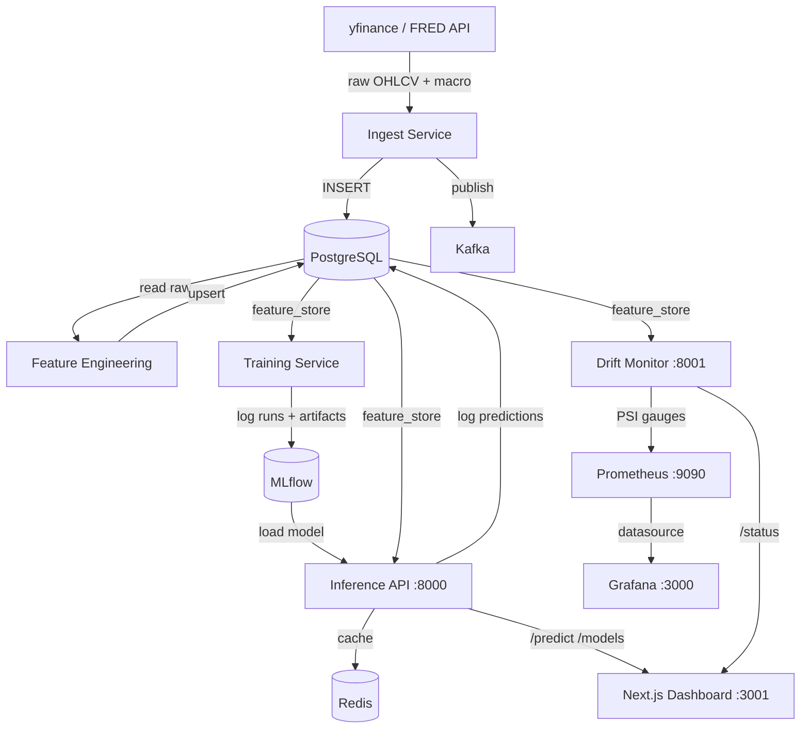

# FinSignal

Production-grade ML platform for S&P 500 return forecasting and feature drift monitoring. Built as a portfolio project demonstrating end-to-end ML engineering: data ingestion, feature engineering, model training, inference serving, and observability.

---

## Architecture



---

## Services

| Service | Path | Port | Description |
|---|---|---|---|
| Ingest | `services/ingest/` | — | Pulls yfinance + FRED data, writes to PostgreSQL, publishes to Kafka |
| Features | `services/features/` | — | Computes 28-column feature matrix (log returns, lags, rolling stats, macro) |
| Training | `services/training/` | — | Trains ARIMA, LightGBM, TFT; tracks experiments in MLflow |
| Sentiment | `services/sentiment/` | — | Finnhub headlines → FinBERT scoring → feature_store |
| Inference | `services/inference/` | 8000 | FastAPI: `/predict`, `/models`, `/health`; Redis-cached |
| Drift | `services/drift/` | 8001 | PSI drift monitoring; exposes Prometheus metrics |
| Frontend | `frontend/` | 3001 | Next.js dashboard: forecast chart, model leaderboard, drift panel |

---

## Model Results

Trained on S&P 500 daily log returns (2005–present). Strict temporal split: train 2005–2020, val 2020–2022, test 2022–present.

| Model | Val MAE | Val Dir% | Test MAE | Test Dir% |
|---|---|---|---|---|
| ARIMA(5,0,0) | 0.00990 | 56.8% | 0.00785 | 52.9% |
| LightGBM | 0.01007 | 52.5% | 0.00804 | 52.7% |
| LightGBM + Sentiment | — | — | — | — |
| TFT (1-day) | — | — | 0.00798 | 45.7% |
| TFT (5-day) | — | — | 0.00776 | — |
| TFT (21-day) | — | — | 0.00805 | — |

~53% direction accuracy across models is the expected result — daily returns are close to a random walk (efficient market hypothesis). TFT adds value at longer horizons where ARIMA degrades.

---

## Running Locally

**1. Start infrastructure**
```bash
cd infra
docker compose up -d
```

**2. Run ingest + feature engineering**
```bash
source .venv/bin/activate

cd services/ingest && python main.py
cd services/features && python engineer.py
```

**3. Train models**
```bash
cd services/training
python train.py
```
MLflow UI: `mlflow ui --backend-store-uri sqlite:///../../mlflow.db --port 5001`

**4. Start inference API**
```bash
cd services/inference
uvicorn main:app --port 8000
```

**5. Start drift monitor**
```bash
cd services/drift
uvicorn main:app --port 8001 --host 0.0.0.0
```

**6. Start frontend**
```bash
cd frontend
npm run dev -- --port 3001
```
Open `http://localhost:3001`

---

## Tech Stack

| Layer | Technology |
|---|---|
| Data | yfinance, FRED API, Finnhub |
| Storage | PostgreSQL 15, Redis 7 |
| Streaming | Kafka (Confluent) |
| ML | ARIMA (statsmodels), LightGBM, TFT (pytorch-forecasting), FinBERT |
| Experiment tracking | MLflow (SQLite backend) |
| Serving | FastAPI, Uvicorn |
| Observability | Prometheus, Grafana |
| Frontend | Next.js 14, TypeScript, Tailwind CSS, Recharts |
| Infra | Docker Compose, Alembic migrations |

---

## Schema

Five tables, managed with Alembic versioned migrations:

- `raw_market_data` — append-only log of all ingested tickers (equity OHLCV + macro series unified)
- `feature_store` — denormalized 28-column feature matrix per (ticker, date)
- `prediction_log` — every inference call with model version, horizon, predicted return, confidence bounds
- `drift_log` — PSI score per feature per check with reference/current window dates and alert flag

See [`docs/adr/002-schema-design.md`](docs/adr/002-schema-design.md) for design rationale.
